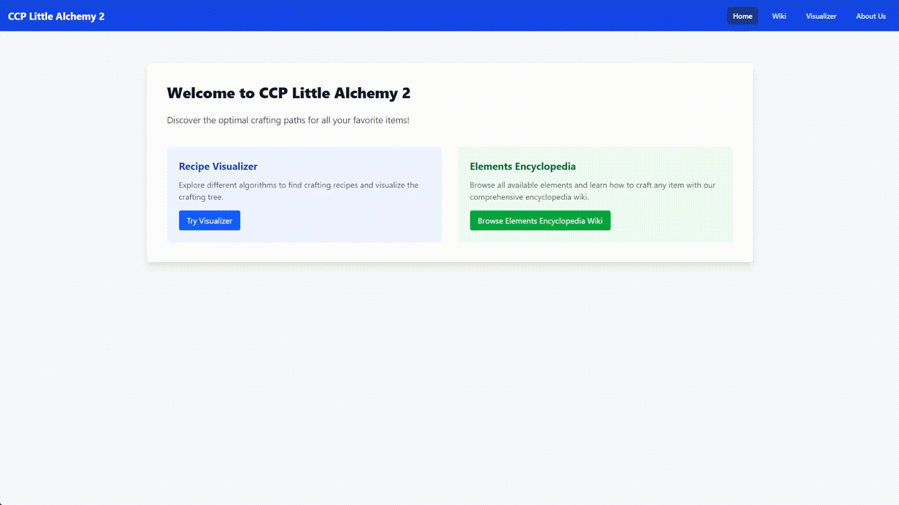
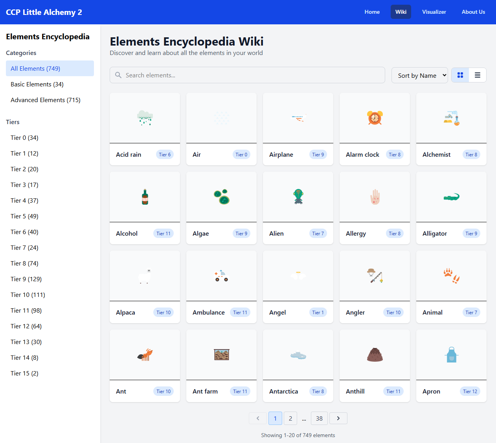
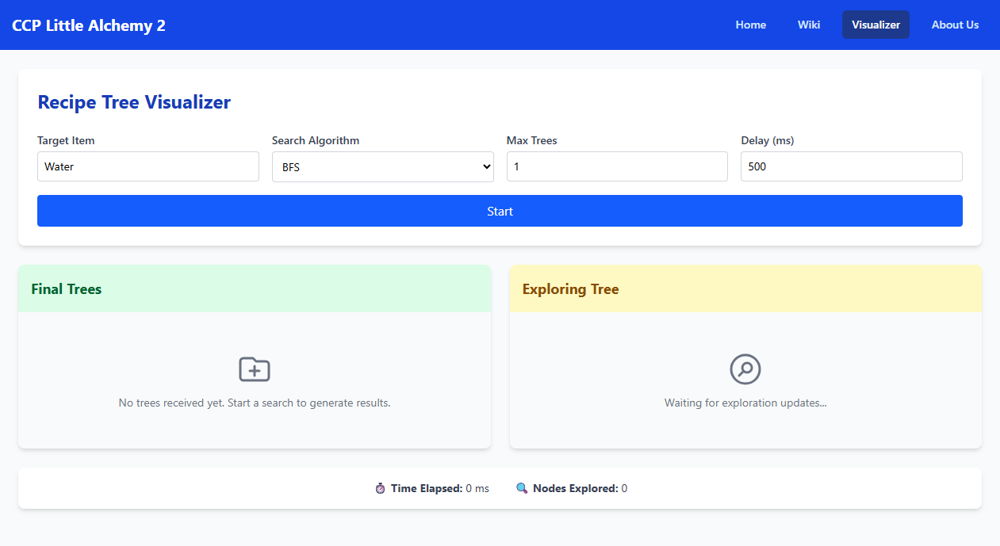

<div align="center"> 
  <h1> CCP Little Alchemy 2 Recipe Finder </h1>
  <h3> Tugas Besar 2 IF2211 Strategi Algoritma </h3>




</div>

## Table of Contents

- [Program Description](#program-description)
- [Fitur Aplikasi](#fitur-aplikasi)
- [Tech Stack](#tech-stack)
- [Getting Started (Lokal)](#getting-started-lokal)
- [Cara Penggunaan Aplikasi](#cara-penggunaan-aplikasi)
- [Authors](#authors)

## Program Description

Program ini merupakan **pencari recipe tree untuk game [Little Alchemy 2](https://littlealchemy2.com/)**. Aplikasi dapat menemukan kombinasi elemen dasar untuk membentuk suatu target item menggunakan algoritma:

- BFS (Breadth-First Search)
- DFS (Depth-First Search)
- Bidirectional Search

Proses searching dilengkapi dengan **mulithreading** dan user dapat **input jumlah recipe yang diinginkan**. Hasil pencarian divisualisasikan secara **real-time dalam bentuk tree**, menunjukkan langkah-langkah pembentukan elemen dari base elements ke target.

---

## Fitur Aplikasi

#### Live Visualization

Menampilkan proses pencarian secara interaktif melalui visualisasi pohon yang dibangun secara bertahap. Pengguna dapat mengatur delay antar update untuk mengamati alur pembentukan elemen secara real-time.

#### Built-in Wiki Integration

Menampilkan informasi lengkap mengenai elemen langsung dari dalam aplikasi, terintegrasi dengan hasil scraping dari Wiki **[Little Alchemy 2](<https://little-alchemy.fandom.com/wiki/Elements_(Little_Alchemy_2)>)**, tanpa perlu membuka tab eksternal.

#### Multiple Recipe Tree Search

Mendukung pencarian lebih dari satu recipe berbeda untuk elemen target. Setiap hasil akan menampilkan struktur pohon unik dengan kombinasi elemen yang valid dan berbeda.

#### Multithreaded Recipe Search

Ketika mode pencarian multiple tree diaktifkan, pencarian dilakukan secara paralel dengan multithreading, memungkinkan efisiensi maksimal dan respons yang lebih cepat.

#### Algoritma Pencarian yang Fleksibel

Mendukung tiga algoritma pencarian:

- Breadth-First Search (BFS)
- Depth-First Search (DFS)
- Bidirectional Search (pencarian dua arah yang efisien untuk skala besar)

Pengguna dapat memilih algoritma yang paling sesuai dengan skenario pencarian.

#### Statistik Pencarian Lengkap

Menampilkan metrik pencarian secara akurat, termasuk:

- Total waktu pencarian (dalam milidetik)
- Jumlah node yang telah dikunjungi

Statistik ini ditampilkan secara live dan akan diperbarui selama proses pencarian berlangsung.

#### Visual Tree Renderer

Hasil pencarian divisualisasikan dalam bentuk struktur pohon yang intuitif dan informatif, menunjukkan urutan kombinasi dari elemen dasar hingga elemen target.

#### Dockerized Deployment

Seluruh stack aplikasi (frontend dan backend) dapat dijalankan secara terisolasi menggunakan Docker. Instalasi menjadi jauh lebih sederhana dan konsisten di semua environment.

#### Web Deployment Ready

Aplikasi telah dikembangkan dan disiapkan untuk deployment ke server publik sehingga dapat diakses secara daring melalui browser tanpa setup tambahan pada **Link Deployment: [CCP Little Alchemy 2 Recipe Finder](https://nyo.kirisame.jp.net)**.

---

## Tech Stack

### 

Digunakan sebagai core engine untuk pemrosesan algoritma pencarian (BFS, DFS, dan Bidirectional). Golang dipilih karena performanya yang tinggi serta dukungan bawaan terhadap concurrency untuk implementasi multithreading.

###  + 

Frontend modern dan responsif dibangun dengan React, dikombinasikan dengan Vite sebagai bundler ultra-cepat. Visualisasi pohon resep dirender secara dinamis, dengan UI ringan dan efisien.

### 

Digunakan untuk mengirim progres pencarian secara langsung ke pengguna. WebSocket memungkinkan eksplorasi tree divisualisasikan secara bertahap selama algoritma berjalan.

### 

Seluruh aplikasi dikemas ke dalam container Docker, memungkinkan proses deployment yang konsisten, ringan, dan portabel baik untuk development lokal maupun production di cloud.

---

## Getting Started (Lokal)

#### 1. Clone Repository

```bash
git clone https://github.com/yonatan-nyo/Tubes2_CCP.git
cd Tubes2_CCP
```

---

#### 2. Run Menggunakan Docker Compose

```bash
docker compose up --build
```

---

## Cara Penggunaan Aplikasi

#### A. Mengakses Built-in Wiki



1. Buka aplikasi melalui browser `http://localhost:4001/`.
2. Klik tab **Wiki** pada navbar di bagian atas.
3. Cari dan lihat informasi lengkap dari elemen-elemen Little Alchemy 2 secara langsung, tanpa perlu membuka tab baru.

#### B. Menggunakan Recipe Tree Finder



1. Klik tab **Visualizer** pada navbar.
2. Isi parameter berikut:
   - **Target Item**: Elemen akhir yang ingin dicari (contoh: Galaxy, Brick, Human, dll.)
   - **Search Algorithm**: Pilih strategi pencarian (DFS, BFS, atau Bidirectional).
   - **Max Trees**: Jumlah maksimum tree (resep berbeda) yang ingin ditemukan.
   - **Delay (ms)**: Jeda dalam milidetik untuk mengontrol kecepatan update visualisasi (semakin besar = lebih lambat).
3. Klik tombol **Start** untuk memulai pencarian.
4. Aplikasi akan menampilkan dua hal secara real-time:
   - **Exploring Tree**: Visualisasi live dari proses pencarian yang sedang berlangsung.
   - **Final Trees**: Kumpulan pohon hasil pencarian lengkap setelah ditemukan.
5. Statistik pencarian akan otomatis muncul di bagian bawah:
   - **Time Elapsed**: Total waktu pencarian (dalam milidetik)
   - **Nodes Explored**: Total simpul (node) yang dikunjungi selama pencarian.

---

## Authors

| Nama                     | NIM      |
| ------------------------ | -------- |
| Varel Tiara              | 13523008 |
| Nathaniel Jonathan Rusli | 13523013 |
| Yonatan Edward Njoto     | 13523036 |
